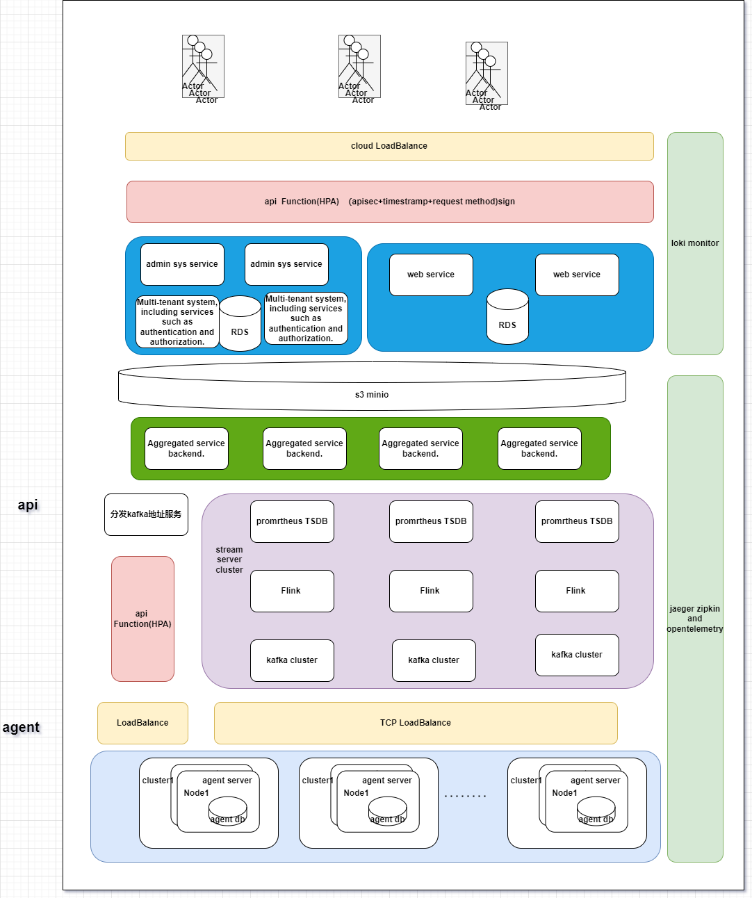

系统架构设计文档

1. 概述
   本文档旨在为一个高可用性、安全性和性能的系统提供粗略的设计方案。该系统由客户端的 Agent 组件和服务端的 API 服务器、控制器等组成，用于收集、处理和分析客户集群的指标数据，并提供优化建议。

2. 架构设计
   2.1 Agent 组件
   - 采用 Kubernetes DaemonSet 部署，确保每个节点上都运行一个 Agent 实例，实现高可用性。
   - Agent 通过 Kubernetes API Server 的认证和授权机制进行安全通信，确保数据的机密性和完整性。
   - Agent 定期从 Kubernetes API Server 抓取指标数据，并通过批处理的方式发送到服务端的 API 端点，减少网络开销。
   - 引入指标数据的缓存机制，在网络不稳定或服务端不可用时，可以暂时存储指标数据，并在恢复后重试发送。

   2.2 API 服务器
   - 采用无状态的设计，通过 Kubernetes Deployment 和 Service 实现高可用性和负载均衡。
   - 使用 Kubernetes Ingress 或 API Gateway 进行安全的 API 端点暴露，并配置 SSL/TLS 证书进行加密通信。
   - 引入速率限制和请求验证机制，防止恶意请求和 DDoS 攻击。
   - 采用异步处理的方式，将接收到的指标数据发送到消息队列（如 Kafka），以提高 API 服务器的响应速度和吞吐量。

   2.3 数据处理和存储
   - 使用消息队列（如 Kafka）作为数据处理的缓冲区，实现数据的解耦和削峰填谷。
   - 采用流处理框架（如 Apache Flink 或 Spark Streaming）对指标数据进行实时处理和聚合，提高数据处理的效率和实时性。
   - 将处理后的指标数据存储到时间序列数据库（如 InfluxDB 或 Prometheus）中，便于后续的查询和分析。
   - 对于冷数据，可以考虑将其归档到对象存储（如 S3）或数据仓库中，以减少存储成本。

   2.4 控制器
   - 采用 Kubernetes Deployment 部署控制器，并通过 HPA（Horizontal Pod Autoscaler）实现自动扩缩容，以应对不同的负载需求。
   - 控制器从时间序列数据库中查询指标数据，并根据预定义的分析算法和规则，生成优化建议。
   - 将生成的优化建议存储到数据库中，并通过 API 或 Web UI 的方式呈现给客户。
   - 引入任务调度机制（如 Kubernetes CronJob），定期触发控制器的分析任务，以生成最新的优化建议。

3. 安全考虑
    - 所有组件之间的通信都应使用 SSL/TLS 加密，并通过相互认证的方式进行身份验证。
    - 对外暴露的 API 端点应配置严格的访问控制策略，并启用 API 密钥或 OAuth 等认证机制。
    - 定期对系统进行安全审计和漏洞扫描，及时修复发现的安全问题。
    - 对敏感数据进行脱敏或加密处理，防止数据泄露。

4. 性能优化
    - 对关键组件（如 API 服务器、数据处理模块）进行性能测试和优化，确保其能够满足高并发和大数据量的需求。
    - 合理设置组件的资源请求和限制，避免资源的过度分配或不足。
    - 采用缓存机制（如 Redis）来存储常用的数据和查询结果，减少数据库的访问压力。
    - 对数据库进行索引优化和查询优化，提高数据查询的效率。
    - 引入分布式追踪和监控系统（如 Jaeger、Prometheus），实时监控系统的性能指标，并根据需要进行优化和调整。

5. 可扩展性和弹性
    - 采用微服务架构，将系统划分为独立的、可扩展的服务，便于水平扩展和升级。
    - 使用 Kubernetes 的自动扩缩容机制（如 HPA），根据实际负载动态调整组件的副本数，以应对流量的波动。
    - 采用无状态的设计，尽量将状态数据存储在外部的数据库或缓存中，以便于组件的扩缩容和故障转移。
    - 引入服务网格（如 Istio）来管理微服务之间的通信和流量，提高系统的可靠性和灵活性。

6. 容灾和备份
    - 采用多可用区（Multi-AZ）部署，将关键组件分布在不同的可用区中，以提高系统的容灾能力。
    - 对关键数据进行定期备份和异地备份，以便在发生灾难时能够快速恢复。
    - 制定详细的故障恢复和数据恢复计划，并定期进行演练和测试。

7. 总结
   本文档提供了一个高可用性、安全性和性能的系统架构设计方案，涵盖了 Agent 组件、API 服务器、数据处理和存储、控制器等关键组件。通过采用 Kubernetes 技术栈、微服务架构、安全最佳实践、性能优化技术以及容灾备份策略，可以构建一个稳定、可扩展、高效的系统，满足业务需求。在实际实施过程中，还需要根据具体的业务场景和非功能需求，对设计方案进行细化和优化。

