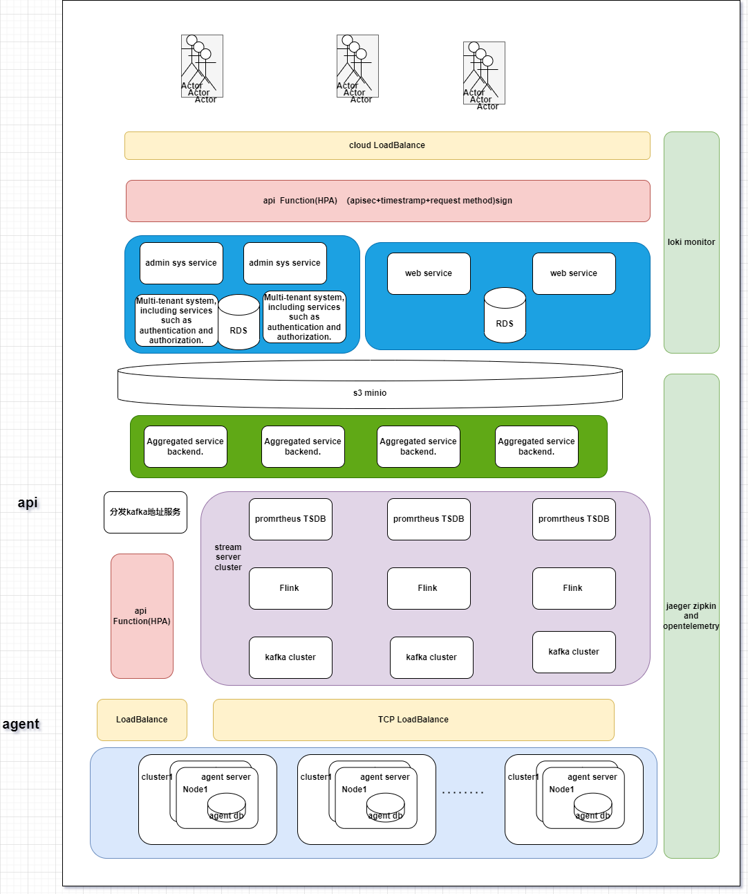

# System Architecture Design Document

## Overview

This document outlines a high-level architecture design for a system that ensures high availability, security, and performance. The system involves an agent component installed in customer clusters, which pushes metrics to a centralized API server. The API server processes and stores these metrics, while a controller analyzes the data to provide optimization recommendations.

## Objectives

- **High Availability**: Ensure the system is resilient to failures and can provide continuous service.
- **Security**: Protect data in transit and at rest, and ensure secure access to system components.
- **Performance**: Optimize the system for efficient processing and low latency.

## Architecture Components

1. **Agent Component**: Installed in customer clusters to collect metrics.
2. **API Server**: Centralized endpoint for receiving and processing metrics.
3. **Controller**: Analyzes metrics and provides optimization recommendations.
4. **Database**: Stores metrics and analysis results (not covered in detail).

## High-Level Architecture

### 1. Agent Component

- **Deployment**: The agent is deployed as a DaemonSet in the customer's Kubernetes cluster to ensure it runs on every node.
- **Metrics Collection**: The agent scrapes metrics from the customer's kube-apiserver.
- **Data Transmission**: Metrics are securely transmitted to the API server using HTTPS.

### 2. API Server

- **Load Balancer**: Use a cloud-based load balancer (e.g., AWS ELB, GCP Load Balancer) to distribute incoming requests across multiple instances of the API server.
- **Kubernetes Deployment**: Deploy the API server as a Deployment in a Kubernetes cluster to manage scaling and updates.
- **Horizontal Pod Autoscaler (HPA)**: Implement HPA to automatically scale the number of API server pods based on CPU/memory usage or custom metrics.
- **Security**: Use TLS for secure communication. Implement authentication and authorization using OAuth2 or API keys.

### 3. Controller

- **Deployment**: Deploy the controller as a StatefulSet in the Kubernetes cluster to maintain state consistency.
- **Analysis Logic**: The controller periodically fetches metrics from the database and performs analysis.
- **Recommendation Engine**: Generate optimization recommendations and store them back in the database.
- **Scalability**: Use HPA to scale the controller based on workload.

### 4. Database

- **High Availability**: Use a managed database service with built-in replication and failover capabilities (e.g., Amazon RDS, Google Cloud SQL).
- **Security**: Encrypt data at rest and in transit. Implement access controls to restrict database access.

## High Availability Strategies

- **Redundancy**: Deploy multiple instances of the API server and controller to avoid single points of failure.
- **Failover**: Use Kubernetes' self-healing capabilities to automatically restart failed pods.
- **Data Replication**: Ensure the database is configured for high availability with automatic failover.

## Security Considerations

- **Network Security**: Use network policies to restrict traffic between components. Implement firewalls and security groups to control access.
- **Data Encryption**: Use TLS for all communications. Encrypt sensitive data at rest.
- **Access Control**: Implement role-based access control (RBAC) for Kubernetes resources. Use IAM roles for cloud resources.

## Performance Optimization

- **Caching**: Implement caching mechanisms at the API server to reduce database load and improve response times.
- **Efficient Data Processing**: Use asynchronous processing for non-critical tasks to reduce latency.
- **Resource Allocation**: Monitor and adjust resource requests and limits for Kubernetes pods to ensure optimal performance.

## Monitoring and Logging

- **Monitoring**: Use Prometheus and Grafana to monitor system performance and health metrics.
- **Logging**: Implement centralized logging using tools like Elasticsearch, Fluentd, and Kibana (EFK) stack for troubleshooting and analysis.

## Conclusion

This architecture design provides a robust framework for building a high-availability, secure, and performant system. By leveraging Kubernetes technologies and cloud services, the system can efficiently handle customer metrics and provide valuable optimization recommendations. The design ensures scalability, resilience, and security, meeting the needs of both the service provider and the customers.

Certainly! Below is a more detailed architecture design for the system, focusing on high availability, security, and performance. This design leverages Kubernetes and cloud-native technologies to achieve the desired objectives.

## Detailed Architecture Design

### 1. Agent Component

- **Deployment**:
    - **Kubernetes DaemonSet**: Deploy the agent as a DaemonSet in each customer's Kubernetes cluster. This ensures that the agent runs on every node, collecting metrics from the kube-apiserver.
    - **Configuration**: Use ConfigMaps for configuration management, allowing dynamic updates without redeploying the agent.

- **Metrics Collection**:
    - **Prometheus Exporter**: Integrate a Prometheus exporter to collect and expose metrics in a standardized format.

- **Data Transmission**:
    - **Secure Communication**: Use HTTPS with mutual TLS authentication to securely transmit metrics to the API server.

### 2. API Server

- **Load Balancer**:
    - **Cloud Load Balancer**: Deploy a cloud-based load balancer (e.g., AWS Elastic Load Balancer, Google Cloud Load Balancer) to distribute incoming requests across multiple API server instances.

- **Kubernetes Deployment**:
    - **Deployment**: Deploy the API server as a Kubernetes Deployment with multiple replicas to ensure high availability.
    - **Service**: Use a Kubernetes Service of type `LoadBalancer` to expose the API server externally.

- **Horizontal Pod Autoscaler (HPA)**:
    - **Autoscaling**: Configure HPA to scale the API server pods based on CPU utilization or custom metrics like request latency.

- **Security**:
    - **Authentication and Authorization**: Implement OAuth2 for secure API access. Use Kubernetes RBAC to control access to resources.
    - **Ingress Controller**: Use an Ingress controller with TLS termination for secure external access.

### 3. Controller

- **Deployment**:
    - **StatefulSet**: Deploy the controller as a StatefulSet to maintain state consistency across replicas.
    - **Leader Election**: Implement leader election to ensure only one active instance of the controller performs analysis at any time.

- **Analysis Logic**:
    - **Batch Processing**: Use a batch processing framework (e.g., Apache Spark) for efficient analysis of large datasets.

- **Recommendation Engine**:
    - **Machine Learning Models**: Integrate machine learning models to generate optimization recommendations based on historical data.

- **Scalability**:
    - **HPA**: Use HPA to scale the controller based on the number of metrics to be processed.

### 4. Database

- **High Availability**:
    - **Managed Database Service**: Use a managed database service (e.g., Amazon RDS, Google Cloud SQL) with multi-zone replication and automatic failover.

- **Security**:
    - **Encryption**: Enable encryption at rest and in transit. Use database-specific IAM roles for access control.

### 5. Monitoring and Logging

- **Monitoring**:
    - **Prometheus and Grafana**: Deploy Prometheus for metrics collection and Grafana for visualization. Use Alertmanager for alerting on critical issues.

- **Logging**:
    - **EFK Stack**: Implement centralized logging using Elasticsearch, Fluentd, and Kibana. Collect logs from all components for analysis and troubleshooting.

### 6. Network Security

- **Network Policies**:
    - **Kubernetes Network Policies**: Define network policies to restrict traffic between pods and ensure only authorized communication.

- **Firewalls and Security Groups**:
    - **Cloud Security**: Use cloud provider firewalls and security groups to control access to the API server and database.

### Conclusion

This detailed architecture design leverages Kubernetes and cloud-native technologies to build a system that is highly available, secure, and performant. By using best practices such as autoscaling, secure communication, and centralized monitoring, the system can efficiently handle customer metrics and provide valuable optimization recommendations. This design ensures resilience, scalability, and security, meeting the needs of both the service provider and the customers.

