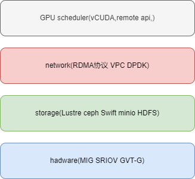

Reducing the cost of GPUs for training and inference in the AI world, especially in a Kubernetes (K8s) environment on the public cloud, involves a combination of strategic resource management, leveraging open-source tools, and innovative architectural designs. Here are some ideas and strategies that could be explored:

### Optimizing GPU Usage

1. **Dynamic GPU Allocation**:
    - Implement a dynamic GPU allocation system that adjusts the number of GPUs allocated to a job based on real-time demand and workload characteristics. This can be achieved using Kubernetes' custom resource definitions (CRDs) and operators to manage GPU resources more efficiently. example: TKE+vCUDA+GPUManager

2. **Spot Instances and Preemptible VMs**:
    - Utilize spot instances or preemptible VMs for non-critical training jobs. These instances are significantly cheaper and can be managed using Kubernetes' node affinity and taints/tolerations to ensure workloads are scheduled appropriately.

3. **Mixed Precision Training**:
    - Adopt mixed precision training techniques to reduce the computational load and memory usage, which can lead to faster training times and reduced GPU costs. Frameworks like NVIDIA's Apex can be integrated into existing training pipelines.

4. **Model Pruning and Quantization**:
    - Use model pruning and quantization to reduce the size and complexity of models, which can decrease the computational resources required for both training and inference.

### Leveraging Open Source Projects

1. **Kubeflow**:
    - Utilize Kubeflow for managing machine learning workflows on Kubernetes. It provides tools for scalable training, hyperparameter tuning, and serving, which can help optimize resource usage.

2. **KEDA (Kubernetes Event-Driven Autoscaling)**:
    - Implement KEDA to scale GPU resources based on custom metrics and events, allowing for more responsive scaling policies that align with workload demands.

3. **NVIDIA GPU Operator**:
    - Use the NVIDIA GPU Operator to manage GPU drivers and runtime components efficiently within a Kubernetes cluster, ensuring optimal performance and resource utilization.

### Architectural Innovations

1. **Federated Learning**:
    - Explore federated learning to distribute training across multiple edge devices, reducing the reliance on centralized GPU resources in the cloud.

2. **Serverless GPU Computing**:
    - Investigate serverless GPU computing models where GPU resources are provisioned on-demand for short-lived tasks, potentially reducing idle time and costs.

3. **Hybrid Cloud Architectures**:
    - Design hybrid cloud architectures that leverage both on-premises and cloud resources, optimizing for cost by using on-premises resources for predictable workloads and cloud resources for bursty workloads.

### Optimizing Kubernetes (K8s) Environment

1. **Resource Requests and Limits**:
    - Fine-tune resource requests and limits for GPU workloads to prevent over-provisioning and ensure that resources are allocated efficiently.

2. **Node Autoscaling**:
    - Implement cluster autoscaling to dynamically adjust the number of nodes in the cluster based on workload demands, ensuring that resources are not wasted.

3. **Efficient Scheduling**:
    - Use advanced scheduling techniques, such as bin-packing algorithms, to optimize the placement of GPU workloads on nodes, maximizing resource utilization.

4. **Monitoring and Optimization Tools**:
    - Deploy monitoring tools like Prometheus and Grafana to gain insights into resource usage and identify optimization opportunities. Use these insights to adjust configurations and improve efficiency.

By integrating these strategies and leveraging open-source projects, organizations can significantly reduce the cost of GPU usage for AI workloads in a Kubernetes environment on the public cloud. These approaches require a combination of technical expertise, strategic planning, and continuous monitoring to achieve optimal results.

# Optimizing GPU Usage and Cost in Public Cloud (Kubernetes)

In the AI-driven world, optimizing GPU usage for training and inference is crucial for reducing costs and improving efficiency. Below are some innovative strategies and approaches to achieve this, focusing on Kubernetes in the public cloud.

## Strategies for Reducing GPU Costs

### 1. **Dynamic GPU Allocation**

- **Concept**: Implement a dynamic GPU allocation system that adjusts the number of GPUs allocated to a job based on its current needs.
- **Implementation**:
   - Use Kubernetes' device plugin framework to create a custom GPU device plugin that supports dynamic allocation.
   - Integrate with a monitoring system (e.g., Prometheus) to track GPU utilization and adjust allocations in real-time.
   - Leverage Kubernetes' Horizontal Pod Autoscaler (HPA) to scale GPU resources based on custom metrics.

### 2. **Spot Instances for Non-Critical Workloads**

- **Concept**: Utilize spot instances for training jobs that are not time-sensitive, taking advantage of lower costs.
- **Implementation**:
   - Use Kubernetes node pools with spot instances for training workloads.
   - Implement a checkpointing mechanism to save progress and resume training if a spot instance is terminated.
   - Use open-source tools like KubeFlow or Argo Workflows to manage job scheduling and checkpointing.

### 3. **Multi-Tenancy and GPU Sharing**

- **Concept**: Enable multiple workloads to share a single GPU, maximizing utilization.
- **Implementation**:
   - Use NVIDIA's Multi-Instance GPU (MIG) technology to partition GPUs into smaller instances.
   - Develop a Kubernetes scheduler extender or custom controller to manage GPU sharing and ensure fair resource allocation.
   - Integrate with Kubernetes' ResourceQuota and LimitRange to enforce resource limits and priorities.

### 4. **Model Optimization and Compression**

- **Concept**: Optimize and compress models to reduce the computational load and GPU usage.
- **Implementation**:
   - Use open-source libraries like TensorRT or ONNX Runtime for model optimization and inference acceleration.
   - Implement techniques like quantization, pruning, and knowledge distillation to reduce model size and complexity.
   - Automate the optimization process using CI/CD pipelines integrated with Kubernetes.

### 5. **Federated Learning and Edge Computing**

- **Concept**: Offload some training and inference tasks to edge devices, reducing the load on cloud GPUs.
- **Implementation**:
   - Use federated learning frameworks (e.g., TensorFlow Federated) to distribute training across edge devices.
   - Deploy lightweight models on edge devices for real-time inference, using cloud GPUs for more complex tasks.
   - Integrate with Kubernetes' edge computing solutions like K3s or KubeEdge for seamless management.

## Optimizing Other Areas in Public Cloud (Kubernetes)

### 1. **Efficient Resource Scheduling**

- **Concept**: Improve resource scheduling to reduce idle time and increase utilization.
- **Implementation**:
   - Use Kubernetes' Cluster Autoscaler to dynamically adjust the number of nodes based on workload demands.
   - Implement a custom scheduler or use open-source projects like Volcano to optimize job scheduling for AI workloads.
   - Use priority classes to ensure critical jobs receive resources first.

### 2. **Cost Monitoring and Optimization**

- **Concept**: Continuously monitor and optimize cloud resource usage to reduce costs.
- **Implementation**:
   - Use open-source tools like KubeCost or Prometheus to monitor resource usage and costs.
   - Implement policies to automatically scale down or terminate underutilized resources.
   - Use Kubernetes' ResourceQuota to enforce cost limits and prevent resource over-provisioning.

### 3. **Serverless AI Workloads**

- **Concept**: Use serverless computing for AI workloads to reduce costs and improve scalability.
- **Implementation**:
   - Use Kubernetes-based serverless platforms like Knative to deploy AI functions that scale automatically.
   - Implement event-driven architectures to trigger AI workloads only when needed.
   - Use open-source frameworks like Kubeless or OpenFaaS for serverless AI deployments.

## Conclusion

By implementing these strategies, organizations can significantly reduce GPU costs and optimize resource usage in the public cloud. Leveraging Kubernetes' capabilities and integrating open-source projects can lead to innovative solutions that enhance efficiency and scalability in AI workloads. This approach not only reduces costs but also improves the overall performance and agility of AI systems.

## Generally Speaking

### Magnum IO
Magnum IO was proposed by NVIDIA. It is a set of efficient data center I/O technologies designed to accelerate data transfer between GPUs and storage devices, optimizing workloads for large-scale parallel computing and high-performance computing (HPC). The theory behind Magnum IO was introduced to improve communication efficiency between GPUs and between GPUs and storage devices in data-intensive applications, thereby enhancing overall system performance.

#### storage service
ceph Swift minio HDFS 预加载的有aluxio

### Network Layer
RDMA(kernel bypass,CPU bypass): RoCEv1 ROCEv2 IB

Communication within the same node: NVLink  
Communication between different nodes: NSwitch + IB (RoCEv1, RoCEv2)

### GPU virtualization technology
#### User Mode：
 - vCUDA remoteAPI
#### Kernel Mode(driver):
- OrionX vGPU
- TKE GPUManage + vCUDA remote api (time division multiplexing)
- alibaba cGPU  eGPU
- Tencent Public Cloud qGPU
- [4paradigm HAMI](http://www.4paradigm.com/)
#### hardware:
- nvidia MIG
- AMD SRIOV
- intel GVT-G

#### parallel computing
nccl mpi gloo
